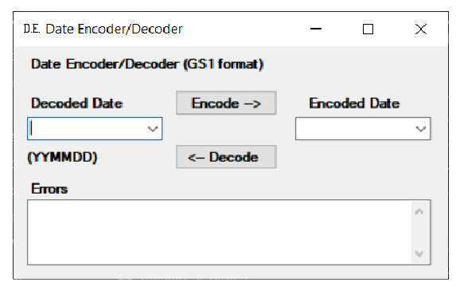
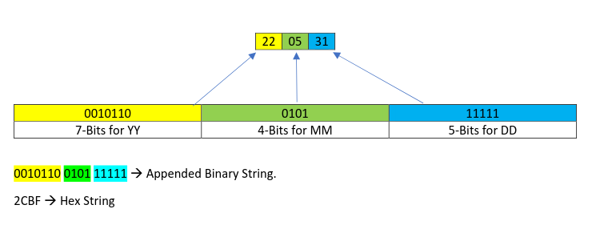

The `DateEncDec.exe` application is intended to encode date in the format `YYMMDD`.

The above image shows a screenshot of the launch of the application. Data is entered into the
fields and the application encodes and decodes date.

### Decoded Date:

The edit box is used by the user to enter date in the YYMMDD format.

### Encoded Date:

The edit box is used to enter the encoded date in HEX format.

### Encode ->

If the button is pressed it encodes the date entered in the Decoded Date text field and displays
the encoded date in the Encoded Date text box.

### Decode ->

If the button is pressed it decodes the Hex data entered in the Encoded Date field and displays it in the Decoded Date Textbox.
Dates can be encoded in several schemes. It represents a date value in well-defined position within the
binary string. Adding dates to the product is useful to enable efficient scanning of perishable items with
limited remaining shelf life or to ensure that all expired/ expiring products have been removed from
sale.

Example for 31st May 2022

The date format only supports 6-digit values `YYMMDD`. Consider the input string as pairs of digits in
which first 2-digits are `YY`, the next 2-digits are `MM`, and the remaining 2-digits are `DD`.

Convert `YY` to decimal integer (e.g., ‘22’ > 22) and convert this to an unsigned binary value, then if the
resulting binary string for `YY` is less than 7-bits, pad to the left with ‘0’ to reach a total of 7-bits.

Convert `MM` to decimal integer (e.g., ‘05’ > 5), convert this to an unsigned binary value, then if the
resulting binary string for `MM` is less than 4-bits, pad to the left with ‘0’ to reach a total of 4-bits.

Convert `DD` to decimal integer (e.g., ‘31’ > 31), convert this to an unsigned binary value, then if the
resulting binary string for `DD` is less than 5-bits, pad to the left with ‘0’ to reach a total of 5-bits.

Append the 7-bits of `YY`, 4-bits of MM and 5-bits of DD. The binary string for date encoding is of 16-bits.
This is now converted into HEX format resulting in 4 Hex characters.

